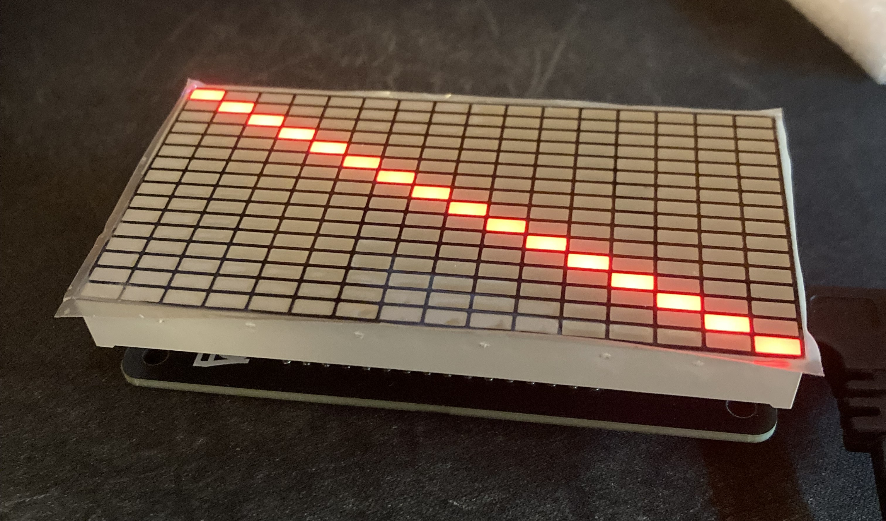

# OSLB56317-XX LED Driver

This project is to drive the OSLB56317 16x16 LED matrix I got from my trip to Japan (from [Akizuki](https://maps.app.goo.gl/3vW3UY29P5pvr1BS6))

# Known Issues
- I goofed up on the RP2040's SPI wiring to the constant current led driver, so for now it is emulated in software
    - todo: make this a PIO block, or even a PIO block to drive the entire display?
- In the CAD file, there is no easy way to take it apart other than pushing a small flat head between the display and the case. With PLA, the case is maluable enough to bend
    - todo: add some small slot eventually to be able to easily remove the display assembly
- In the schematic, the columns and row new names should be swapped (don't ask how that happened), but this has no effects on functionality
- In `Firmware_FFT`, every now and then the main loop will unexpectantly stop, randomly
    - todo: attach debugger and see what causes this crash, probably some incorrect memory indexing
    
# todo, maybe
- [ ] Develop a PIO block for the LED matrix
- [ ] Create more fun demo codes (animation?)
- [x] Create a USB audio spectrum analyzer

# License
This project, except for the external [Firmware_FFT/Adafruit_ZeroFFT](Firmware_FFT/Adafruit_ZeroFFT), is licensed under GPLv3. See [LICENSE.md](LICENSE.md) for details.

# Credit
A fork of [Adafruit's ZeroFFT library, by donmccoy](https://github.com/donmccoy/Adafruit_ZeroFFT/tree/bugfix), was used in this project, and that is licensed under BSD-3

